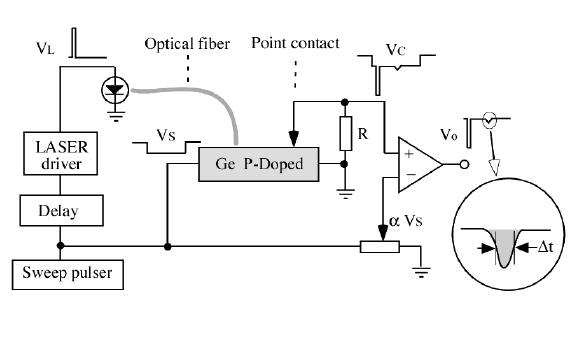
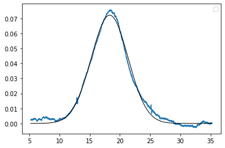
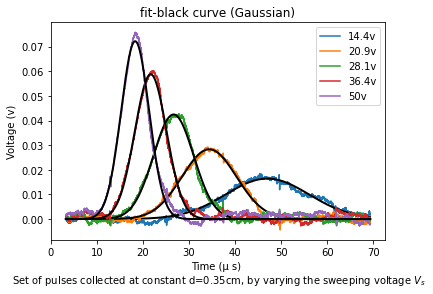

# Haynes-Shockley experiment
> The charge mobility in semiconductor materils.

It was the first experiment to measure directly the drift velocity, and thus mobility, of minority carriers. Previously the drift velocity was determined with the Hall effect, which was an direct method whose results could not be easily interpreted.
In the original H-S experiment an electric field is created along a small bar of a doped semiconductor (cut from a single crystal ingot) by applying an experimental voltage across the bar ends. Then a short pulse injects excess minority charge carriers into the sample which are successively swept along the bar by the electric field. By detecting and analyzing the excess-charge pulse during its travel, the drift velocity, the diffusion constant and lifetime may be calculated.
>
>#### More Study
><a href="https://www.labtrek.it/haynes-shockley-experiment/">labtrek</a> 
><a href="https://aip.scitation.org/doi/pdf/10.1063/1.334081">aip.scitation.org
></a>
>### Goals
>- Minority charge carrier amount.
>- the effect of the distance electrodes on the production of electrons and 
>holes.
>- measuring of carrier's lifetime.

>Block diagram for optical injection and point-contact collector

Important fields are: ***lifetime, drift velocity, electric field***

<h3>Measurement of the time of flight t</h3>

 Due to the constant of the distance and the moving fields, the flight time is also constant, which does not depend on the density of the laser pulse. so light pulse just increases the peak of the graph relevant to the voltage. Despite the fact that t is grown by increasing inject charge density.

On the oscilloscope screen we may observe a first short negative pulse, with amplitude comparable to that of the injection pulse VI and, after some delay t, a second negative pulsee, wider and much smaller than the first one. An example of the collected signal in a <em>N-doped</em> Ge sample, with posittive injecting and sweep pulses is shown below (here the excess injected carriers are holes, not electrons). 

The first peak is simultaneous with the injection pulse: it is due to the electromagnetic signal propagating across the sample. The second pulse (the top plot) corresponds to the excess-charge distribution passing under the collector contact: its shape is approximately <a href="https://en.wikipedia.org/wiki/Gaussian_function"><em>Gaussian</em></a> and its amplitude and width are determined by diffusion and recombination processes.
An analytical interpretation of the pulse shape, based on the solution of the time dependent diffusion equation, may be found in Gaussian coefficients. 

<h3>Measurment of drift velocity</h3>

  Es is an internal electric pulse field that produced by a pulsed generator. Distance between optical fiber and needle (<ins>point contact</ins>) is <em>d</em>.  Vs is the electrical pulls and Vl is the laser pulls. The lasr pulls causes 2 small peak between up and down main semiconductor peak. The second peak is the wider and relevant to minority carriers.

<!DOCTYPE html>
<html>
<head>
</head>
<body>
  <h3>Information that can be extracted from the pulse shape and position</h3>
  <table>
    <tr>
      <td>the drift velocity</td>
      <td></td>
    </tr>
      <tr>
    <td>sweep field (L : sample length)</td>
    <td></td>
  </tr>
    <tr>
        <td>so electron mobility is</td>
        <td></td>
    </tr>
    <tr>
        <td>then relation of Diffusion and collected pulse</td>
        <td></td>
  </tr>
</table>

 The semiconductor sample is a thin bar (approximately 3x3x30 mm) of single crystal ingot.

  ***photo electric effect (LASER beam) causes the drift mobility of minority charge carriers sweeps length of the semiconductor.***
    <section>
      The excess charges may be generated by a light pulse (by exploiting the internal photoelectric effect) e.g. using a beam, produced by LASER diode, and the emitted light beam is guided by an optical fiber with one end replacing the emitter point contact.
    </section>

</body>
</html>

# Coding structure (or how to code)
### First step
> How to code a simple project and improve it?
1) The first point is considering that we have an excel file of data with few sheets, which we need to plot them as x and y axes. So, for the start we use a simple code as [flights](https://github.com/SMNIK/Haynes-Shockley-experiment/blob/master/flights.py);, to read each sheet inside the excel file and plot them. However, rather than using the Repetitious lines we can use loop like 'for' or 'while'; For example:
'''python
      for i in ("14.4v","20.9v","28.1v","36.4v","44.7v"):
          i = pd.read_excel(<excel file address>,i)
          i = i.iloc[250:4238] >
          plt.plot(i['x'],i['y'])

''' 
2) The second point is to creat the auto key that read the excel file with browser (auto-plot-button.py and ...button2.py).
3) in the third part the idea is the key knows any x and y sheet of any file and plot it automaticly.

### The fit files
For creat fit for each figure, start by creat our function and fit it with one of the sheets (first part of fitting test).
Then in the second part the auto key read whole datas and prepaire the fit for each plot inside the loop, as the exponential function.

