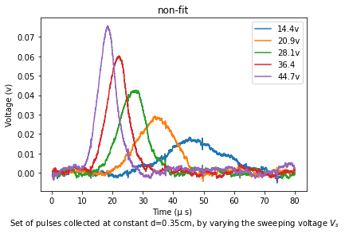

# Haynes-Shockley experiment
> The charge mobility in semiconductor materils.

It was the first experiment to measure directly the drift velocity, and thus mobility, of minority carriers. Previously the drift velocity was determined with the Hall effect, which was an direct method whose results could not be easily interpreted.
In the original H-S experiment an electric field is created along a small bar of a doped semiconductor (cut from a single crystal ingot) by applying an experimental voltage across the bar ends. Then a short pulse injects excess minority charge carriers into the sample which are successively swept along the bar by the electric field. By detecting and analyzing the excess-charge pulse during its travel, the drift velocity, the diffusion constant and lifetime may be calculated.
>
>#### More Study
><a href="https://www.labtrek.it/haynes-shockley-experiment/">labtrek</a><br>
><a href="https://aip.scitation.org/doi/pdf/10.1063/1.334081">aip.scitation.org
></a>
>### Goals
>- Minority charge carrier amount.
>- the effect of the distance electrodes on the production of electrons and 
>holes.
>- measuring of carrier's lifetime.


>Block diagram for optical injection and point-contact collector

Important fields are: ***lifetime, drift velocity, electric field***

<h3>Measurement of the time of flight t</h3>
<p> Due to the constant of the distance and the moving fields, the flight time is also constant, which does not depend on the density of the laser pulse. so the spectrom just increases the peak of the graph relevant to the voltage. Despite the fact that t is grown by increasing inject charge density.</p>

On the oscilloscope screen we may observe a first short negative pulse, with amplitude comparable to that of the injection pulse V<sub>I</sub> and, after some delay t, a second negative pulse, wider and much smaller than the first one. An example of the collected signal in a <em>N-doped</em> Ge sample, with posittive injecting and sweep pulses is shown below (here the excess injected carriers are holes, not electrons). 




The first peak is simultaneous with the injection pulse: it is due to the electromagnetic signal propagating across the sample. The second pulse (the top plot) corresponds to the excess-charge distribution passing under the collector contact: its shape is approximately <a href="https://en.wikipedia.org/wiki/Gaussian_function"><em>Gaussian</em></a> and its amplitude and width are determined by diffusion and recombination processes.
An analytical interpretation of the pulse shape, based on the solution of the time dependent diffusion equation, may be found in Gaussian coefficients. 

<h3>Measurment of drift velocity</h3>
<p>
  E<sub>s</sub> is an internal electric pulse field that produced by a pulsed generator. Distance between optical fiber and needle (<ins>point contact</ins>) is <em>d</em>.  V<sub>s</sub> is the electrical pulls and V<sub>l</sub> is the laser pulls. The lasr pulls causes 2 small peak between up and down main semiconductor peak. The second peak is the wider and relevant to minority carriers.
</p>

<!DOCTYPE html>
<html>
<head>
</head>
<body>
  <h3>Information that can be extracted from the pulse shape and position</h3>
  <table>
    <tr>
      <td>the drift velocity</td>
      <td><a href="https://www.codecogs.com/eqnedit.php?latex=V_{d}=\frac{d}{t}" target="_blank"></a></td>
    </tr>
      <tr>
    <td>sweep field (L : sample length)</td>
    <td><a href="https://www.codecogs.com/eqnedit.php?latex=E_{s}=\frac{V_{s}}{L}" target="_blank"></a></td>
  </tr>
    <tr>
        <td>so electron mobility is</td>
        <td><a href="https://www.codecogs.com/eqnedit.php?latex=\mu&space;=\frac{|V_{d}|}{|E_{s}|}=\frac{Ld}{t&space;V_{s}}" target="_blank"></a></td>
    </tr>
    <tr>
        <td>then relation of Diffusion and collected pulse</td>
        <td><a href="https://www.codecogs.com/eqnedit.php?latex=(\Delta&space;t\&space;V_{d})^{2}=16&space;\&space;ln(2Dt)" target="_blank"></a></td>
  </tr>
</table>
<p> The semiconductor sample is a thin bar (approximately 3x3x30 mm) of single crystal ingot.</p>

<div>
<em>photo electric effect (LASER beam) causes the drift mobility of minority charge carriers sweeps length of the semiconductor.</em><br>
The excess charges may be generated by a light pulse (by exploiting the internal photoelectric effect) e.g. using a beam, produced by LASER diode, and the emitted light beam is guided by an optical fiber with one end replacing the emitter point contact.


</div>
<hr>
</body>
</html>

# Coding structure (or how to code)
### First step
> How to code a simple project and improve it?
1) The first point is considering that we have an excel file of data with few sheets, which we need to plot them as x and y axes. So, for the start we use a simple code as [flights](https://github.com/SMNIK/Haynes-Shockley-experiment/blob/master/flights.py) to read each sheet inside the excel file and plot them. However, rather than using the duplicate lines we can use loop like 'for' or 'while'; For example:
```python
      for i in ("14.4v","20.9v","28.1v","36.4v","44.7v"):
          i = pd.read_excel(<excel file`s address and name>,i)
          i = i.iloc[250:4238] 
          plt.plot(i['x'],i['y'])

``` 
2) In general we go more far and use ***tkinter*** library for providing a browser key to choose any file that we want to plot. The basic code start by [auto-plot-button](https://github.com/SMNIK/Haynes-Shockley-experiment/blob/master/auto-plot-button.py) and as you see in this file we have duplicate lines too. finally, in [auto-plot-button2](https://github.com/SMNIK/Haynes-Shockley-experiment/blob/master/auto-plot-button2.py) and completely in [Button(complete)](https://github.com/SMNIK/Haynes-Shockley-experiment/blob/master/Button(complete).py) we can replace repetitive lines by more professional commands.
```python
    for i in sheetNames:
        SMN = pd.read_excel(import_file_path, i)
        SMN = SMN.iloc[250:4238]
        print(i)
```
  *****with the above command, we do not need to write name of each sheets in the code. The machine completely read sheet's name and know each plot belongs to each name. So, we can use the button browser for any different excel file with many different sheets and names.*****

3) In the following step, I will provide the [Gaussian](https://en.wikipedia.org/wiki/Gaussian_function) fit as a fit function to use its coefficients for the further calculations.

###Second step
***The Gaussian fit***
According to the Gaussian function: 

=a\cdot&space;\exp&space;{\left(-{\frac&space;{(x-b)^{2}}{2c^{2}}}\right)}})

The a,b,c coefficients clarify the value of the maximum, mean and the mean width of the drift. However, first we need to normalize the data by below computation:
```python
n = len(x)
mean = sum(x*y)/n
sigma = sum(y*(x-mean)**2)/n
```  
However, rather than c, here I wrote sigma and for b, x0 (or may be in some explanations from other tutorial the gaussian function has different coefficients' names).

For the defining the gaussian function and coefficients the bellow command lines highly recommended (or the same):
```python
def gauss(x,a,x0,sigma):
  return (a*np.exp(-0.5*((x-x0)/sigma)**2))
popt, pcov = curve_fit(gauss,x,y,p0=[0,mean,sigma])

```
As you see, the arguments to the function is x (in excel file, it shows time column), followed by parameters. Now it is good time to call <em>curve_fit</em> to find the best-fit parameters using a least-squares fit:
```python
popt, pcov = curve_fit(gauss,x,y,p0=[0,mean,sigma])
```
The <em>curve_fit</em> function returns two items, which we can popt and pcov. The popt arqument are the best-fit parameters for a and x0. <br>
And then we can use 'plt' command to plot fit on each signal.<br>


But, you know that this is just the first step of the way to find standard coefficients. 
For finding the time of each maximum peak (x0) from fit value, write as below:
```
t = popt[1]
```
and for "Area", normalization of popt[2] and popt[0] are required:
```python
Area = popt[0]*2*popt[2]*np.sqrt(np.pi/2)
```
So, write some more command lines and calculate the other options that we need.
Here we have the voltage values like the name of each sheet. Besides, we know that our code knows them as strings, not decimal.<br>
Wow, sounds good, it looks like we should use a command trick to convert them to decimal numbers for our calculation. Because I think so, your sheets' names are different and this type of coding lets us to use this program for any file, however on the same scale.<br>
***use Regular expression operations library***
```python
import re 
I = [float(SMN) for SMN in re.findall(r'-?\d+\.?\d*', i)]
        c = len(I)
        for SMN in range(c):
            E_s = I[SMN]/d
```
Go further and just write some functions to calculate drift velocity, sweep field, and electron mobility, which they are the functions from the first table (on the top).
Totaly, this was the coding for open the excel file for ploting datas, then prepaire a good fit for each one and calculate the coefficients.
For the next part, you should pick out each normalized data from loop and save them as a analyses (or any name that you prefer) excel file, not only for the analys table but also for ploting the logarithmic area as the time. 